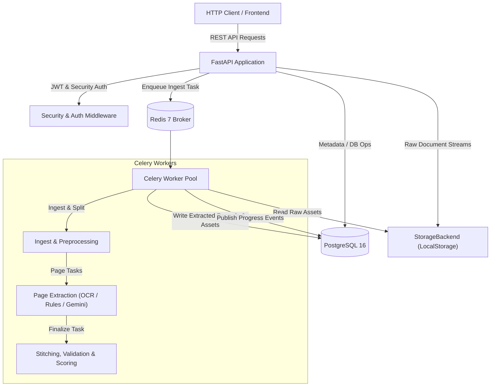
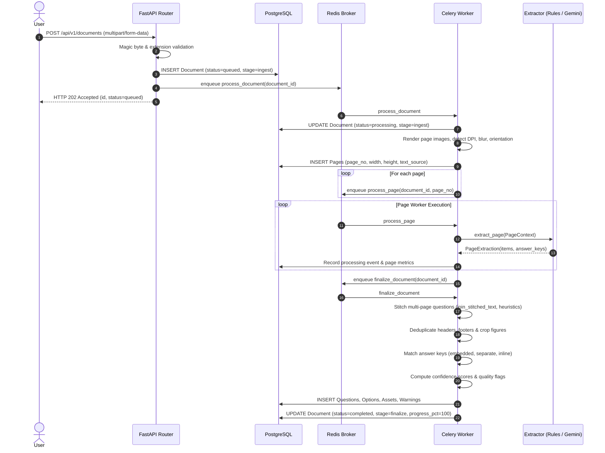
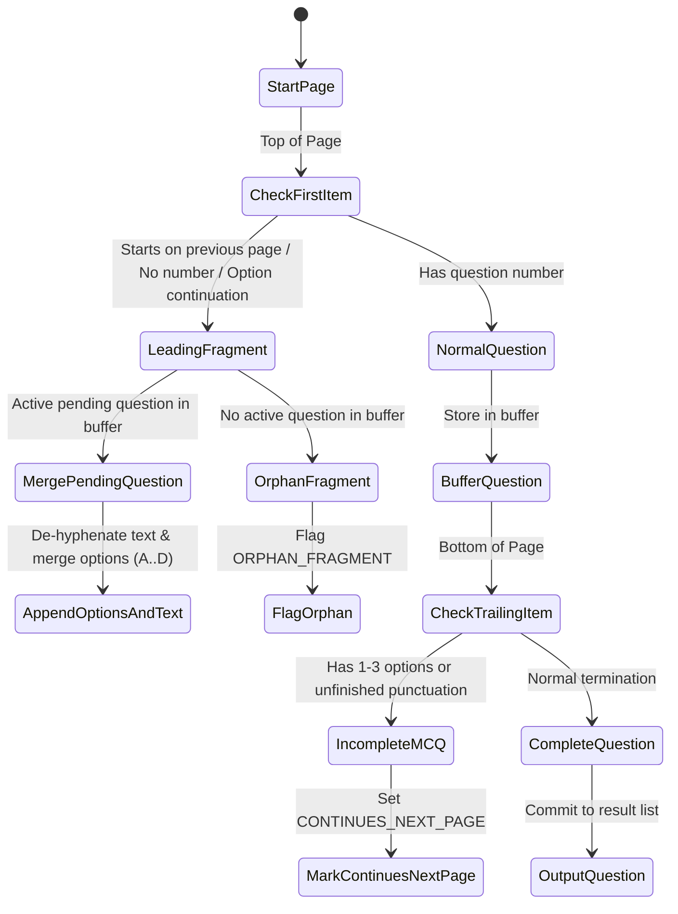

# Architecture & System Design

This document details the design and internal mechanisms of the **Document Intelligence & Question Extraction Service**.

---

## 1. High-Level System Overview

The service processes examination papers and assessments (digital PDFs, scanned PDFs, single/multi-page images) into structured, question-level JSON schemas. It runs as an asynchronous pipeline with distinct web, background worker, database, and storage layers.



---

## 2. Component Architecture

### 2.1 API Layer (`app/api/v1/`)
- **FastAPI**: Asynchronous route handlers for document uploads, question queries, answer key management, document link reconciliation, and human review workflows.
- **Strict Owner Isolation**: Every query filters by `owner_id = current_user.id`. Foreign resource IDs return `404 Not Found` rather than `403 Forbidden` to eliminate ID enumeration vulnerabilities.
- **Immediate Response**: Document uploads stream to disk/storage, compute SHA-256 hashes, validate magic bytes, create the database record with status `queued`, enqueue a Celery task, and immediately respond with HTTP `202 Accepted`.
- **409 Conflict Protection**: Attempts to fetch extracted questions or export schemas while processing is ongoing return `409 DOCUMENT_NOT_READY`.

### 2.2 Worker Pipeline (`app/pipeline/` & `app/workers/`)
The processing pipeline executes across three ordered stages:



---

## 3. Extraction Engines

The system implements a pluggable `Extractor` interface with two primary implementations:

1. **`RulesExtractor` (`app/pipeline/extractors/rules.py`)**:
   - Operates 100% locally and offline without external API dependencies.
   - Utilizes deterministic regular expressions for numbered lists (`1.`, `(1)`, `Q.1`, `[1]`, roman numerals, Hindi numerals).
   - Detects multi-column and inline option patterns (`(A)`, `(B)`, `(C)`, `(D)`).
   - Detects inline answer markers (`Ans: (b)`, `Answer - A`).

2. **`GeminiExtractor` (`app/pipeline/extractors/gemini.py`)**:
   - Uses `google-genai` SDK with strict Pydantic structured output models (`PageExtractionModel`).
   - Grounding validation: Runs fuzzy matching via `rapidfuzz` against the raw OCR/text layer. If grounding score falls below 0.60, questions are flagged with `LOW_GROUNDING`.
   - Fallback protection: If Gemini returns 429 quota exhaustion or network timeout, the pipeline falls back to `RulesExtractor` and attaches the `LLM_FALLBACK_USED` flag.

---

## 4. Multi-Page Question Stitching

Exam questions frequently break across page boundaries (e.g., question text and options A/B on page 1, options C/D on page 2).



### De-hyphenation & Stitching Rules
- **Text Merging**: When `text_a` ends with a trailing hyphen (`"elec-"`) and `text_b` starts with letters (`"tricity"`), `join_stitched_text` removes the hyphen to restore `"electricity"`.
- **Option Merging**: Continuation options on following pages are normalized into sequential labels (`A`, `B`, `C`, `D`) without duplicating letters.
- **Confidence Propagation**: Stitched questions take the minimum OCR confidence across all source pages.

---

## 5. Answer Key Detection & Multi-Document Reconciliation

### 5.1 Embedded Answer Keys
If an answer key table appears at the start or end of a question paper (e.g. `paper_with_key_at_end.pdf`), the parser extracts question-answer pairs and reconciles them during finalization.

### 5.2 Standalone Answer Key Documents (`document_links`)
When answer keys are uploaded as separate PDF documents:
1. User creates a link via `POST /api/v1/documents/{id}/links` with `link_type="answer_key_for"`.
2. Reconciliation worker fetches questions from the question paper and keys from the answer document.
3. Matching assigns status:
   - `matched`: Exactly one valid option matches the key.
   - `ambiguous`: Key maps to multiple candidate options.
   - `conflict`: Inline document answer disagrees with separate answer key.
   - `not_found`: Question has no matching key in the key document.
   - `invalid`: Key references an option letter not present in the question (e.g., key says `Z` for 4-option MCQ).

---

## 6. Confidence Scoring Engine & Quality Flag Catalog

Question confidence scores are computed mathematically per SPEC §10:

$$\text{Confidence} = 0.40 \cdot C_{\text{ocr}} + 0.30 \cdot C_{\text{grounding}} + 0.20 \cdot C_{\text{seq}} + 0.10 \cdot C_{\text{llm}} - \sum \text{Penalties}$$

### Quality Flags and Severity:
- **Critical Flags** (forces status to `needs_review` regardless of numeric score):
  - `OCR_LOW_CONFIDENCE`, `MISSING_NUMBER`, `DUPLICATE_NUMBER`, `MCQ_OPTIONS_LT_2`, `ANSWER_KEY_CONFLICT`, `UNGROUNDED_EXTRACTION`.
- **Warning Flags** (deducts 0.05 to 0.15 confidence):
  - `CROSS_PAGE_STITCHED`, `STITCH_UNCERTAIN`, `SEQUENCE_GAP`, `ORPHAN_FRAGMENT`, `BLURRY_IMAGE`, `IMAGE_ROTATED`, `IMAGE_SKEWED`.

---

## 7. Human Review & Audit Trail

```mermaid
flowchart LR
    Queued["Status: queued"] --> Processing["Status: processing"]
    Processing --> Extracted["Status: extracted"]
    Processing --> NeedsReview["Status: needs_review"]

    NeedsReview -->|PATCH /questions/{id}| Edited["Status: edited"]
    NeedsReview -->|POST /questions/{id}/review (accept)| Approved["Status: approved"]
    NeedsReview -->|POST /questions/{id}/review (reject)| Rejected["Status: rejected"]
    Edited --> Approved

    subgraph Audit Trail
        Edited -.->|Snapshot before & after| Revisions[(question_revisions)]
    end
```

Every modification through `PATCH /api/v1/questions/{id}` captures:
- Revision number increment.
- Full `previous_state` snapshot JSON.
- Full `new_state` snapshot JSON.
- User ID and UTC timestamp.
